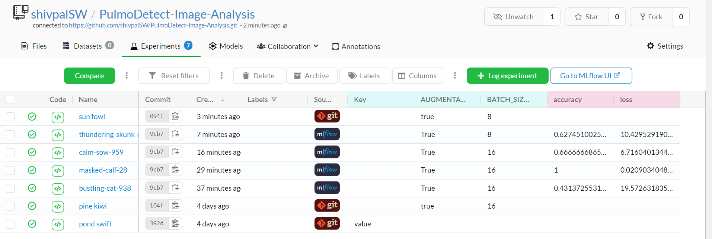
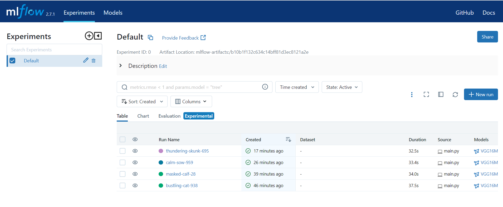
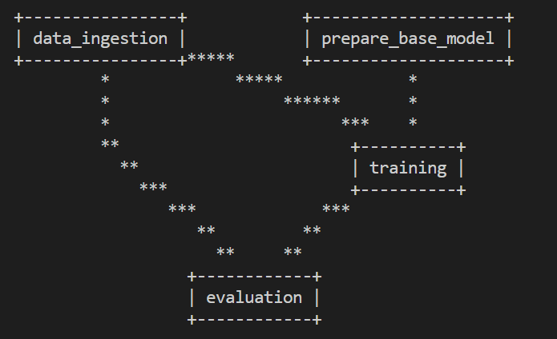
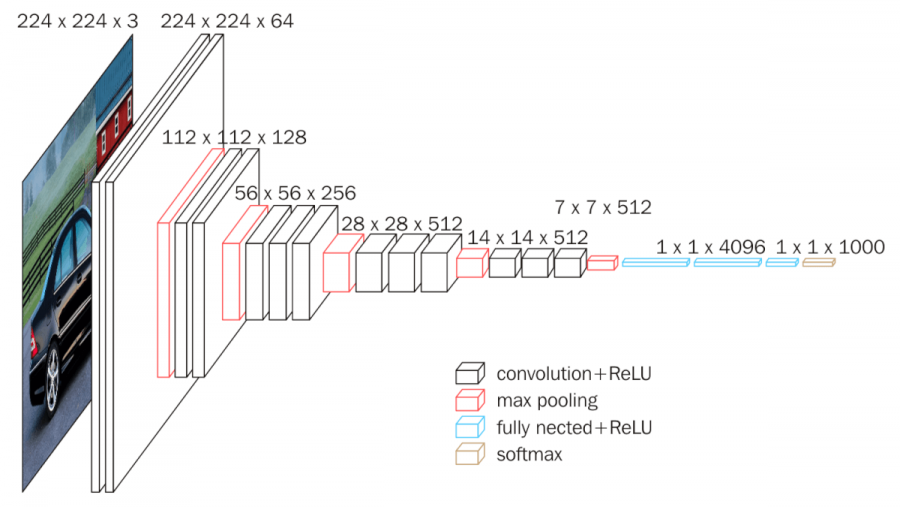
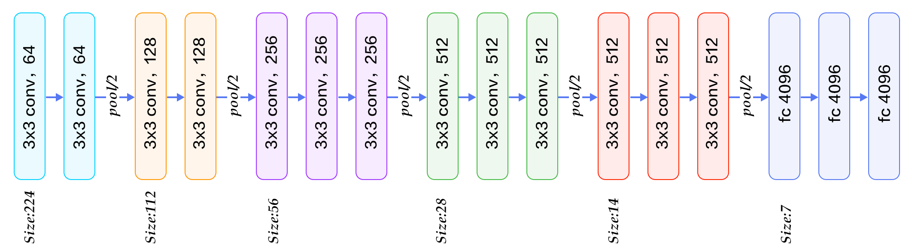
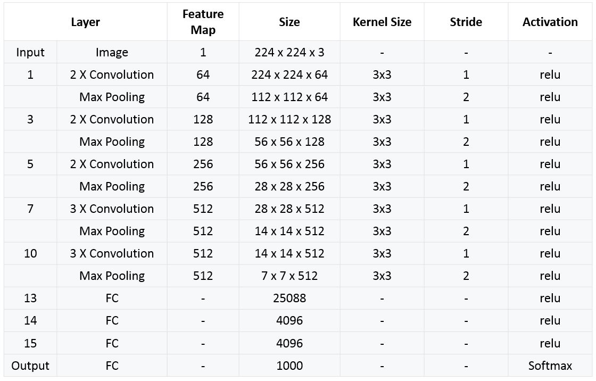

# PulmoDetect-Image-Analysis
PulmoDetect Image Analysis


### MLFLOW DagsHub conenction URI

```bash
MLFLOW_TRACKING_URI=https://dagshub.com/shivpalSW/PulmoDetect-Image-Analysis.mlflow \

MLFLOW_TRACKING_USERNAME=shivpalSW \

MLFLOW_TRACKING_PASSWORD=fd9835dc3730b9bbb51bd3649a76d8c3cbbe007f \

python script.py

```

### Run below commands from gitbash terminal
```bash
export MLFLOW_TRACKING_URI= https://dagshub.com/shivpalSW/PulmoDetect-Image-Analysis.mlflow 

export MLFLOW_TRACKING_USERNAME=shivpalSW 

export MLFLOW_TRACKING_PASSWORD=fd9835dc3730b9bbb51bd3649a76d8c3cbbe007f 

python script.py
```

### DagsHub Tracking UI


### MLFLOW Tracking UI



### dvc commands used on gitbash & DVC DAG 
1. dvc init
2. dvc repro 
3. dvc dag


### VGGNet-16 Architecture
The input of VGG is set to an RGB image of 224x244 size. The average RGB value is calculated for all images on the training set image, and then the image is input as an input to the VGG convolution network. A 3x3 or 1x1 filter is used, and the convolution step is fixed. . There are 3 VGG fully connected layers, which can vary from VGG11 to VGG19 according to the total number of convolutional layers + fully connected layers. The minimum VGG11 has 8 convolutional layers and 3 fully connected layers. The maximum VGG19 has 16 convolutional layers. +3 fully connected layers. In addition, the VGG network is not followed by a pooling layer behind each convolutional layer, or a total of 5 pooling layers distributed under different convolutional layers. The following figure is VGG Structure diagram:


VGG16 contains 16 layers and VGG19 contains 19 layers. A series of VGGs are exactly the same in the last three fully connected layers. The overall structure includes 5 sets of convolutional layers, followed by a MaxPool. The difference is that more and more cascaded convolutional layers are included in the five sets of convolutional layers.


 - [VGG16 Architecture link](https://www.kaggle.com/code/blurredmachine/vggnet-16-architecture-a-complete-guide)